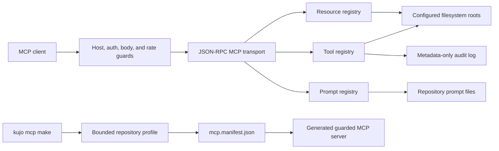

# Architecture

The repository has one guarded runtime and one generator. Both expose the same
standard MCP method families while keeping repository access behind explicit
configuration and path checks.

The demo runtime reads `mcp-server.json`, fails closed on invalid security
settings, and registers capabilities from `src/tools` and `src/resources`.
Recursive tools enforce entry, file, byte, depth, result, and operation budgets
without following symlinks. The optional cache is process-local and expires at
the next minute boundary; callers can bypass it with `refresh_index`.

For multi-instance deployments, `http.rate_limit_strategy: external` delegates
quota accounting to a trusted gateway. The gateway must remove client-supplied
attestation headers, enforce the shared limit, and inject the configured secret
header only for admitted requests. Missing or incorrect attestation fails
closed with HTTP 429.
